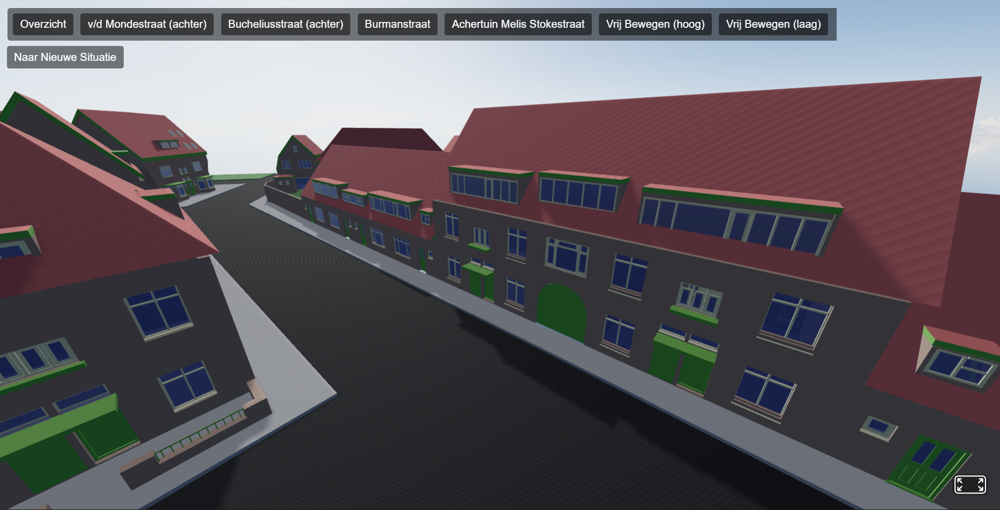

# Webviewer Vernieuwing Tuinwijk-west
- **Project:** Vernieuwing Tuinwijk-west
- **School:** Hogeschool Utrecht
- **Voor:** InsideOut
- **Auteur:** Projectgroep C (Hidde, Jeff, Jesse, Kilian)

*Voorbeeld van de webpagina:*

## Inleiding
Deze webviewer is ontwikkeld als onderdeel van een project voor de Hogeschool Utrecht in samenwerking met InsideOut. Het doel van deze webviewer is om een interactieve 3D-weergave te bieden van de huidige en nieuwe situatie van het Tuinwijk-west project, waarbij gebruikers verschillende aspecten van het ontwerp kunnen verkennen.

De website is ontwikkeld met behulp van HTML, CSS en JavaScript, met gebruik van de [Three.js](https://threejs.org/) bibliotheek voor 3D-rendering via [A-Frame](https://aframe.io/). De 3D-modellen zijn gemaakt in Revit en geoptimaliseerd voor webgebruik met Blender.

De website is openbaar toegankelijk tijdens en een periode na het project via de volgende link: [https://jesyx27.github.io](https://jesyx27.github.io/).

## Meshes
De 3D-modellen van de webviewer zijn te vinden in de mappen [models/](assets/models) & [models/huidigesituatie/](assets/models/huidigesituatie/). Deze zijn als .fbx-model uit Revit geëxporteerd en vervolgens geoptimaliseerd voor webgebruik met behulp van Blender. Ook zijn handmatig alle plain materials toegekend aan de objecten in Blender. De objecten zijn vervolgens als glTF-bestanden geëxporteerd voor gebruik in de webviewer, door de compacte en efficiënte bestandsindeling. Hieronder is een overzicht van de gebruikte modellen:

Modelnaam                                                                                  | Situatie | Beschrijving
-------------------------------------------------------------------------------------------|----------|-
[`huidige_situatie-191225.glb`](assets/models/huidigesituatie/huidige_situatie-191225.glb) | Huidig   | Originele huidige situatie model.
[`pgc_huidig.glb`](assets/models/huidigesituatie/pgc_huidig.glb)                           | Huidig   | Bewerkt Huidige situatie model voor webviewer, deze wordt gebruikt in de webviewer.
[`pgc_vloer.glb`](assets/models/pgc_vloer.glb)                                             | Huidig   | De grond van de huidige situatie, incl. wegen, stoepen en groen.
[`pgc_n_bravo.glb`](assets/models/pgc_n_bravo.glb)                                         | Nieuw    | De InsideOut Bravo module in de nieuwe situatie (zonder bovenkant container).
[`pgc_n_bravodek.glb`](assets/models/pgc_n_bravodek.glb)                                   | Nieuw    | De bovenkant van de container van de InsideOut Bravo module.
[`pgc_n_cellullosevloer.glb`](assets/models/pgc_n_cellullosevloer.glb)                     | Nieuw    | Vloerisolatie van een grootdeel van de woningen.
[`pgc_n_pur_isolatie.glb`](assets/models/pgc_n_pur_isolatie.glb)                           | Nieuw    | Gevelisolatie van elke woning.
[`pgc_n_pv_blauw.glb`](assets/models/pgc_n_pv_blauw.glb)                                   | Nieuw    | Blauwe zonnepanelen op de daken.
[`pgc_n_pv_oranje.glb`](assets/models/pgc_n_pv_oranje.glb)                                 | Nieuw    | De oranje/rode zonnepanelen op de daken, voor aesthetische consistentie vanaf het straatbeeld.
[`pgc_n_tussenvloer.glb`](assets/models/pgc_n_tussenvloer.glb)                             | Nieuw    | Een tussenvloer die de begane grond en eerste verdieping van de woningen scheidt bij alle BIS-woningen.
[`pgc_n_vacuumvloer.glb`](assets/models/pgc_n_vacuumvloer.glb)                             | Nieuw    | Vacuümisolatie in de vloer bij de voormalige winkels.

## HDRI's & Belichting
De scene wordt belicht met een HDRI-omgeving en een directionele zonlichtbron, dit zorgt voor realistische belichting én schaduwen in de 3D-weergave. De zon is ingesteld op een hoek van 45 graden om lange, zachte schaduwen te creëren die de diepte en details van het model benadrukken, de positie van de zon kan in de code aangepast worden naar wens.

De HDRI's die in de webviewer worden gebruikt voor belichting en achtergrond zijn te vinden in de map [hdris/](assets/hdris/). Deze zijn gedownload van [Poly Haven](https://polyhaven.com/hdris). Uiteindelijk is er gekozen voor het gebruik van [Drakensberg Solitary Mountain (Pure Sky)](https://polyhaven.com/a/drakensberg_solitary_mountain_puresky), omdat deze de beste balans bood tussen realistische belichting en een neutrale achtergrond die niet afleidt van het model zelf en waarop tekst te projecteren valt (zie kop ***Camerabeelden & Teksten***). De HDRI's kunnen gerendered worden in A-Frame door de [aframe-hdr-environment-map](github.com/mwbeene/aframe-hdr-environment-map) geschreven door [Mike Beene](https://github.com/mwbeene). 

*Voorbeeld van de HDRI - Drakensberg Solitary Mountain (Pure Sky):*

## Camerabeelden & Teksten
De webviewer bevat verschillende vooraf ingestelde camerabeelden die gebruikers kunnen selecteren om specifieke aspecten van het ontwerp te verkennen. Elk camerabeeld is gekoppeld aan een specifieke locatie en oriëntatie binnen de 3D-scene, zodat gebruikers snel kunnen navigeren naar interessante punten van het model. Ook is er een vrije camera-modus beschikbaar, waarmee gebruikers de camera vrij kunnen bewegen en roteren om het model vanuit elke gewenste hoek te bekijken. Tot slot bevatten de meeste camerabeelden een korte toelichting die verschijnt wanneer het beeld wordt geselecteerd, om extra context en informatie te bieden over wat er in dat specifieke deel van het model te zien is.  Alle camerabeelden zijn ingesteld in [index.html](index.html) zelf. Hieronder is een korte beschrijving van de verschillende camerabeelden:

Camerabeeld   | Naam                          | Tekst in Toelichting
--------------|-------------------------------|---------------------
`c_ovzt`      | Overzicht                     | Welkom bij de webviewer van het Tuinwijk-west renovatieproject. Op deze website worden de geplande renovaties openbaar gesteld. Er worden zonnepanelen, beter geisoleerd glas en een centrale verwarmingseenheid (IO-Bravo) geplaatst. Daarnaast worden alle woningen in het projectgebied voorzien van een cellulose- of vacuumvloer, een tussenvloer en tot slot pur- & dakisolatie. Al met al brengt dit het mediaan energielabel in de buurt van X naar Y. De renovaties, en hun invloed op het uiterlijk van de buurt kunnen afgebeeld worden in verschillende zichthoeken; gebruik hiervoor de bovenstaande knoppen. Ook kan er tussen de oude en de nieuwe situatie omgeschakeld worden met de knop 'Naar Nieuwe/Oude Situatie'. Tot slot kan er rondgekeken worden met de muis, in de 'Vrij Bewegen' cameramodi met de knoppen 'W', 'A', 'S' & 'D'
`c_vdm-achtr` | v/d Mondestraat (achter)      | Veel woningen in het projectgebied krijgen zonnepanelen Zo'n XX zonnepanelen in totaal.Die leveren samen YY kWh per jaar op Dat is genoeg om ZZ huizen te voorzien.
`c_bl-achtr`  | Bucheliusstraat (achter)      | Met zonnepanelen die dezelfde kleur hebben als het dak, kan het karakter van de wijk zo gelijk mogelijk blijven. Deze worden geplaatst op plekken die vanaf het straatbeeld goed zichtbaar zijn. Zoals hier op de oosterlijke achterdaken van de Bucheliusstraat
`c_gn-achtr`  | Burmanstraat                  | Ook hier op de achterdaken van de Gerard Noodstraat, zichbaar van de Burmanstraat, is er gekozen voor zonnepanelen met dezelfde kleur als het dak. De blauwe zonnepanelen zijn vanaf de straat nauwelijks zichtbaar door de bosschage
`c_brv-bovn`  | Achtertuin Melis Stokestraat  | In de achtertuin van de woningen aan de Melis Stokestraat wordt de module 'IO-Bravo' geplaatst.Deze van InsideOut module kan collectieve verwarming leveren voor de hele wijk.
`c_free-high` | Vrij Bewegen (hoog)           | ...
`c_free-low`  | Vrij Bewegen (laag)           | ...

## Lettertype
Initieel was het standaard lettertype (Roboto) rebruikt voor de teksten in de scene. Echter wordt deze door een JavaScript-library gerenderd die enkel ASCII-karakters ondersteund. Aangezien de Nederlandse taal (onder meer in de teksten op de pagina) ook andere karakters bevat als ë, ï, é, etc. moet er een aangepast lettertype gemaakt worden om de tekst correct af te beelden. Dit is gedaan met de [MSDF font generator](https://msdf-bmfont.donmccurdy.com); een tool waarmee aangepaste MSDF-lettertypen gemaakt kunnen worden. Het aangepaste lettertype is nogsteeds gebaseerd op Roboto. Het bevat alle standaard Nederlandse karakters en $_2$ om te gebruiken in de tekst '$CO_2$'. 
